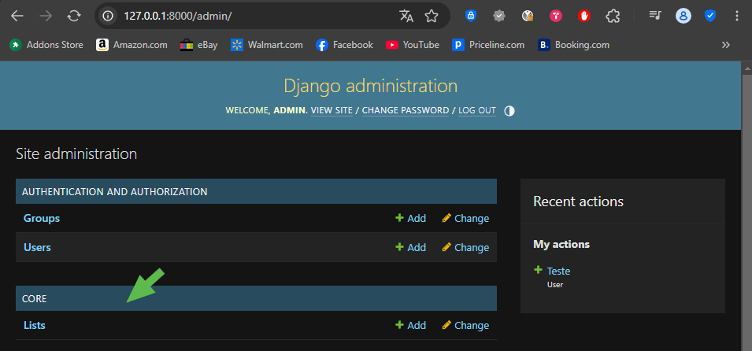

# Desenvolvimento web com Django, React e deploy AWS e Linux

Curso: [Desenvolvimento web com Django, React e deploy AWS e Linux](https://www.udemy.com/course/desenvolvimento-web-com-django-react-e-deploy-aws-e-linux/)

## React

### Criando um novo app React 19

```bash
npm config set legacy-peer-deps true #To solve the error with React 19
npx create-react-app <nome_para_o_projeto>
cd <nome_para_o_projeto>
npm install --save-dev ajv@^7 #To install the missing dependency
npm start
```

## Django

### Exibindo pacotes instalados na venv

```bash
pip freeze
```

#### Enviando a lista de pacotes instalados para o requirements.txt

```bash
pip freeze > requirements.txt
```

### Criando um novo app Django 4.2

Dei preferencia por criar uma nova venv Python e instalar o Django 4.2 nela:

```bash
# Com a venv já ativada:
pip install django==4.2
django-admin startproject <nome_para_o_projeto> .
python manage.py runserver
```

### Django Rest Framework

[Django Rest Framework](https://www.django-rest-framework.org/)

```bash
pip install djangorestframework
pip install markdown       # Markdown support for the browsable API.
pip install django-filter  # Filtering support
```

[Quickstart](https://www.django-rest-framework.org/tutorial/quickstart/)

```bash
python manage.py migrate
python manage.py createsuperuser --username admin --email admin@example.com
```

#### Serializers

São como os arquivos POCO em .Net. Definem as entidades que serão utilizadas no projeto.

#### Views

Definem como as entidades serão retornadas, endpoints.

#### Testando os endpoints

Sendo necessário autenticação, usa-se a url: http://127.0.0.1:8000/admin/

### Criando o app Core

```bash
# Com a venv já ativada:
python manage.py startapp core
```

1. Registrando o novo app

    Será necessário registrar o novo app em [settings.py](./backend/djangoapp/settings.py).

    ```python
    ...
    # Application definition

    INSTALLED_APPS = [
        ...
        'core',
    ]
    ```

2. Adicionando novos models

    Novos models são adicionados em [models.py](./backend/core/models.py). Ex:

    ```python
    from django.db import models
    from django.contrib.auth.models import User

    class List(models.Model):
        owner = models.ForeignKey(User, on_delete=models.CASCADE)
        name = models.CharField(max_length=50)
        created_at = models.DateTimeField(auto_now_add=True)

        def __str__(self):
            return self.name
    ```

3. Registrando o novo Model no [admin.py](./backend/core/admin.py)

    ```python
    ...
    # Register your models here.
    from .models import List

    admin.site.register(List)
    ```

4. Atualizando o Banco de dados após a criação de um novo model

    ```bash
    # Com a venv já ativada:
    python manage.py makemigrations # Atualizando o Migrate
    python manage.py migrate # Aplicando o Migrate
    python manage.py runserver # Iniciando o servidor
    ```

    

5. Adicionando um endpoint

    Criar um novo arquivo [serializers.py](./backend/core/serializers.py):

    ```python
    from rest_framework import serializers
    from .models import List

    class ListSerializer(serializers.HyperlinkedModelSerializer):
        class Meta:
            model = List
            fields = '__all__'
    ```

    Atualizar o arquivo [views.py](./backend/core/views.py):

    ```python
    ...
    from rest_framework import permissions, viewsets

    from .models import List

    from .serializers import ListSerializer

    # Create your views here.
    class ListViewSet(viewsets.ModelViewSet):
        """
        API endpoint that allows Lists to be viewed or edited.
        """
        queryset = List.objects.all().order_by('-created_at')
        serializer_class = ListSerializer
        permission_classes = [permissions.IsAuthenticated]
    ```

    Atualizar o arquivo [urls.py](./backend/djangoapp/urls.py):

    ```python
    ...
    from core.views import ListViewSet
    ...
    router.register(r'lists', ListViewSet)
    ```

#### Incluindo os Itens no endpoint de Lists

[Writable Nested Serializers](https://www.django-rest-framework.org/topics/writable-nested-serializers/)

```python
class ListSerializer(serializers.HyperlinkedModelSerializer):
    # Notar que foi necessário alterar a ordem em que as classes aparecem no arquivo.
    # A classe ItemSerializer é referenciada na classe ListSerializer, então a classe ItemSerializer
    # deve ser declarada antes da classe ListSerializer. Caso contrário, o código não funcionará. 🤦‍♂️
    item_set = ItemSerializer(many=True) # Setando o campo item_set
    class Meta:
        model = List
        # fields = '__all__'
        fields = ['name', 'owner', 'url', 'item_set'] # Incluindo o campo item_set
```
